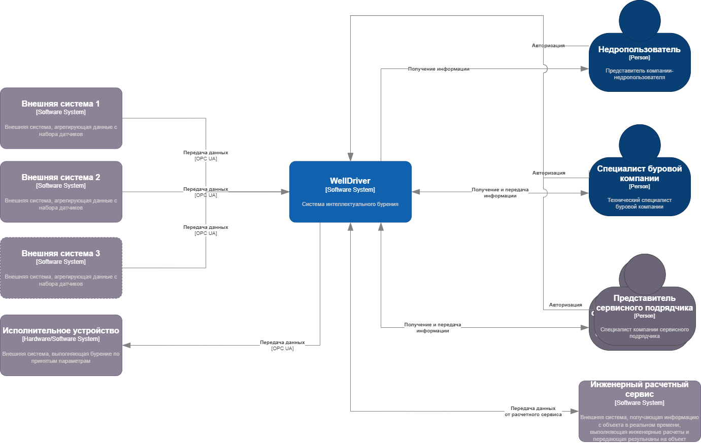
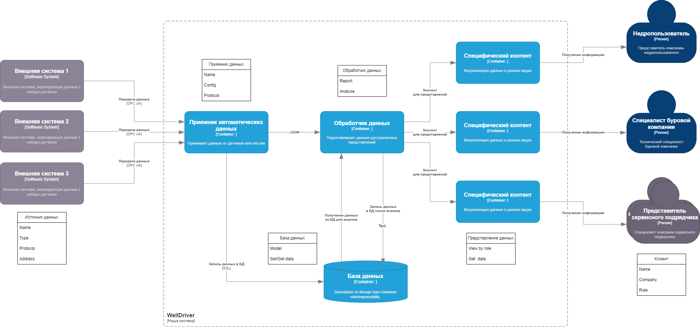
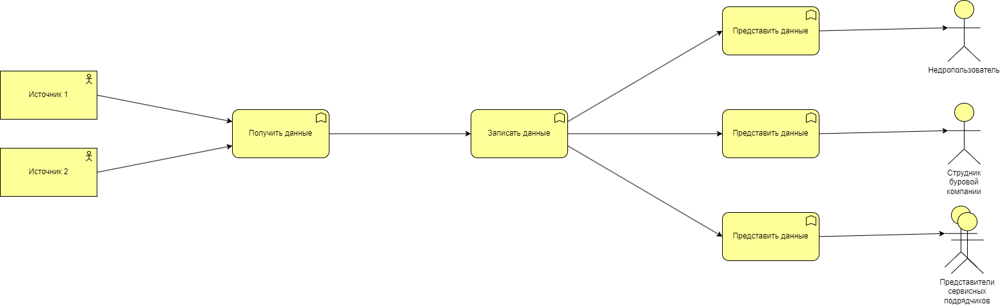

# ADR2 - Выбор архитектурного подхода к реализации WellDriver

# Решение ПРИНЯТО

## Контекст

Для системы WellDriver, основные требования которой описаны в документе [WellDriver](../WellDriver.md) и на основании контекстной схемы [ADR1](ADR1.md) необходимо разобрать различные варианты аррхитектурных подходов к реализации системы WellDriver.

# Контекстная схема системы WellDriver

## Вариант - Разбиение на сущности:

* Сущность - клиенты: сотрудники и специалисты различных компаний (недропользователи, буровые компании, сервисные подрядчики)
* Сущность - специфический контент для пользователя
* Сущность - источники данных на буровой
* Сущность - универсальный приемник автоматических данных
* Сущность - хранилище данных
* Сущность - обработчик данных для подготовки специфического контента

## Вариант - Функциональное разбиение:

 
* Функция - получить данные со всех источников.
* Функция - предварительно обработать данные.
* Функция - записать все данные в хранилище (БД).
* Функция - предоставить информацию пользователю в зависимости от запроса и роли.
* Функция - настроить конфигурацию (роли пользователей, новые источники данных). 

## Сравнение сущностного и функционального подходов:
На первый взгляд разбиение по блокам похоже, но "the devil in the details":
Функция Представление данных по ролям пользователей может выполняться в разных сущностях и это может повлиять на модифицируемость:
* в сущности Обработчик данных происходит предварительная обработка информации:
	* валидация полученных данных; 
	* рассчет допонительных параметров по сырым данным в реальном времени;
	* подготовка отчетов по результатам исторических данных;	
* в сущности Специфический контент производится подготовка информации "на лету" по запросам  пользователей согласно ролевой модели:
	* агрегация данных в зависимости от запроса; 
	* визуализация информации;	
	* предоставление доступа к специфическим ресурсам;
	
## Комментарий

Модель работы с данными пользователей системы WellDriver напоминает кейс по заказу товара на маркетплейсе.

| WellDriver                                 | Маркетплейс                                           |
|--------------------------------------------|-------------------------------------------------------|
| Получение данных на буровой установке      | Получение ходовых товаров по спискам маркетологов     |
| Сохранение данных в локальном хранилище    | Накопление товаров на складе маркетплейса             |
| Подготовка контента для представления      | Маркетинг, упаковка                                   |
| Предоставление данных сотрудникам компаний | Выбор и выдача товаров пользователям по их интересам  |

# Решение:
Для реализации системы WellDriver выбран архитектурный подход разбиения на сущности по предметным областям. Сущностный подход, как DDD, в настоящий момент является наиболее прогрессивным при построении программной архитектуры.   
 
# Последствия решения:

* возможны изменения в схеме разбиения на сущности

# Риски:
* невозможность учесть все возможные варианты добавления или изменения сущностей и их взаимодействия

