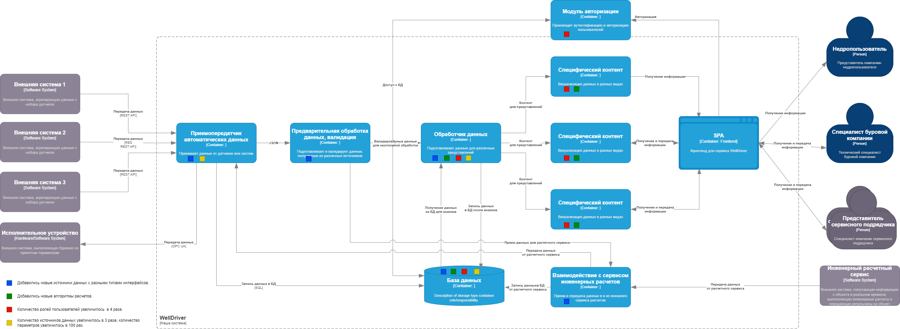
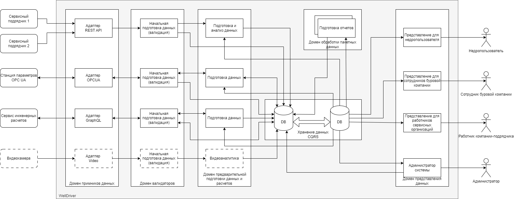

# ADR5 - Оценка модифицируемости компонентов WellDriver

## Решение ПРИНЯТО

## Контекст

* Требования к системе WellDiver прописаны в документе [WellDriver](../WellDriver.md)
* Контекстная диаграмма была проработана в [ADR1](ADR1.md)
* Выбор архитектурного подхода был разобран в [ADR2](ADR2.md)
* Компонентная схема системы была принята в [ADR3](ADR3.md)
* Необходимо оценить модифицируемость компонентов WellDriver

## Сценарии изменений

* Добавились новые источники или приемники данных с разными типами интерфейсов и обработки.
* Добавились новые алгоритмы расчетов.
* Количество ролей пользователей увеличилось  в 4 раза.
* Количество источников данных увеличилось в 3 раза, количество параметров увеличилось в 100 раз.

Понятно, что сценариев может быть значительно больше.

## Сравнительный анализ модифицируемости по сценариям

С оценкой стоимости реализации изменений:
* $$$ - потребуются очень большие изменения;
* $$ - потребуются значительные изменения;
* $ - потребуются незначительные изменения;

### Синий сценарий - Добавились новые источники данных с разными типами интерфейсов.
* Как видно из анализа, добавление новых источников или приемников данных с разными интерфейсами вляет на изменения в реализации 3 сервисов - Приемника, Обработчика и БД.
* Приемник надо модифицировать с точки зрения расширения возможности приема и передачи данных по другим протоколам и способам подключения - $$$.
* Обработчик надо модифицировать с точки зрения обработки новых типов данных - $$.
* БД надо модифицировать для хранения новых типов данных и атрибутов  - $. 

### Зеленый сценарий - Добавились новые алгоритмы расчетов.
* Этот сценарий влияет на сервисы Обработчика, БД и Представления специфического контента
* В Обработчик надо добавлять новый код, реализующий новые алгоритмы расчетов - $$$.
* В БД надо добавлять новые сущности по алгоритмам - $.
* Представления надо модифицировать с точки зрения визуализации новыйх результатов расчетов $$.

### Красный сценарий - Количество ролей пользователей увеличилось  в 4 раза. 
* Этот сценарий влияет на Обработчик, БД и Представления.
* Обработчик должен готовить данные для новых ролей - $$.
* БД должна сохранять информацию о ролях пользователей для разделения доступа - $$.
* Представления должны визуализировать контент для новых ролей - $$$.

### Желтый сценарий - Масштабирование - Количество источников данных увеличилось в 3 раза, количество параметров увеличилось в 100 раз..
* Реализация этого сценария влияет на Приемник, Обработчик и БД
* Примник должен выдерживать поступление большого количества информации из разных источников - $$$.
* БД должна уметь сохранить всю поступающую информацию и реализовывть backup данных - $$.
* Обработчик должен успевать обрабатывать все поступающие данные, в том числе в режиме реального времени - $$$.

## Анализ
* Видно, что вырисовывается 3 доменных области - Прием и передача информации, Обработка и Представление.
* Основные изменения по сценариям пришлись на 2 сущности - Обработчик и БД, причем в БД нужно делать, в основном, незначительные изменения. 
* Видно два полюса притяжения - Получение - передача данных и Представление, которые пытаются разорвать Обработчик и БД.
* Также возможна некоторая универсализация подходов:
    * Получение и передача данных - использование стандартных интерфейсов и модульности.
	* Обработчик -  с точки зрения модульности (плагины) по алгоритмам.
	* Представление - настраиваемый модуль для фронтенда.
* Необходима доработка с точки зрения управления конфигурациями и новая роль - Алминистратор системы.	

### Вариант нового раделения:

Вырисовывается несколько доменов предметной области:
* Домен приемников и передатчиков данных - для каждого типа приемника (пердатчика) свой адаптер.
* Домен начальной подготовки данных по правилам - валидация данных - для каждого типа приемника свое правило
* Домен предварительной обработки данных  - здесь производятся расчеты по данным реального времени, агрегация данных и т.п.
* Домен обработки пакетных данных - подготовка информации по историческим данным - отчеты и т.п.
* Домен хранения данных - хранилище данных, база данных, доступ к хранилищу организован по паттерну CQRS.
* Домен представления данных - каждому пользователю предоставляется свой контент в зависимости от роли.

Домены приемников и начальной подготовки данных можно объединить.

# Решение:
По анализу модифицируемости преобразована схема компонентов и их взаимосвязей по доменам предметной области.
 
# Последствия решения:

* возможны новые сценарии, которые могут повлиять на модифицируемость
* реализован универсальный подход к приемникам и передатчикам данных, теперь любой источник данных, будь то удаленный сервис инженерных расчетов или frontend может быть как приемником, так и передатчиком информации 

# Риски:
* недостаточная проработка вариантов модиыфицируемости
* возможные риски универсального подхода

