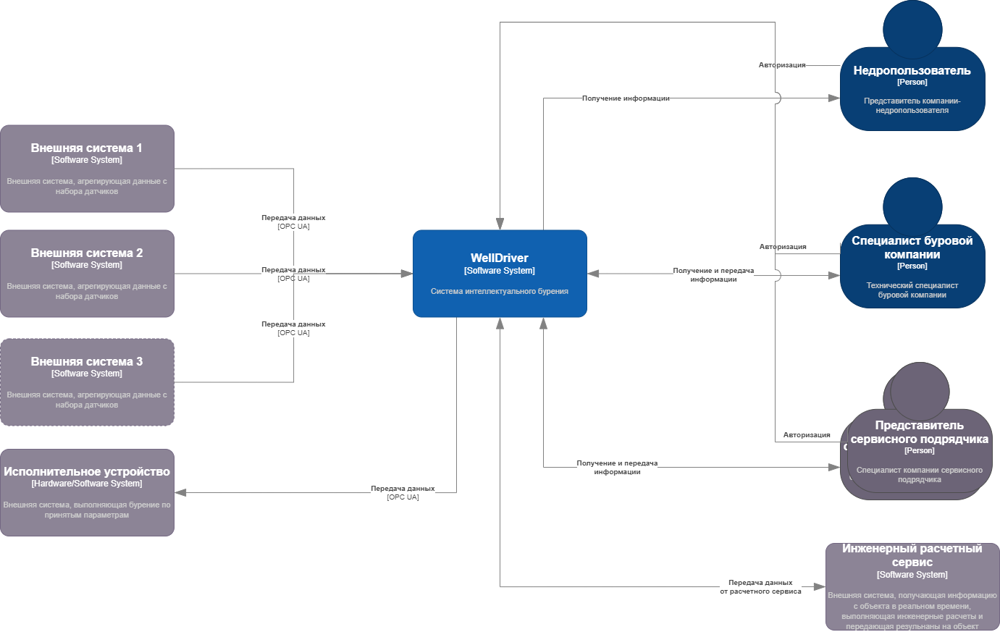

#ADR1 - # Контекстная диаграмма сервиса WellDriver

# Решение ПРИНЯТО

## Контекст

Для системы WellDriver, основные требования которой описаны в документе [WellDriver](WellDriver.md) необходимо проработать общую схему взимодействия основных участников и представить ее в нотации C4 - Context.

# Схема

## Особенности

* На диаграмме пердставлены основные участники и компоненты сервиса WellDriver на текущий момент времени.
* От внешних сервисов система получет данные в реальном времени.
* Количество внешних систем может изменяться
* Протоколя приема данных от внешних сервисов могут быть любыми (пока OPC UA, как наиболее универсальный)
* Приемопередатчик принимает информацию от многих внешних систем и передает ее на предварительную обработку
* Также приемопередатчик принимает расчетную информацию от инженерного сервиса и передает ее на исполнительное устройство для автоматического бурения.
* Компонент предварительной обработки адаптирует информацию от многох приемников и производит валидацию данных по различным критериям.
* После валидации данные поступают в в локальную базу данных и для обработки информации в реальном времениЮ например, для непрерывного мониторинга.
* Модули представления выводят информацию в различных видах, в зависимости от роли подключенных участников.
* Также модульобработки производит анализ пакетных данных, например, отчетов.
* Компонент взаимодействия с внешним сервисом инженерных расчетов передает realtime данные во внешний сервис и принимает данные из него.
* Модуль авторизации производит аутентификацию и автоизацию пользователей по ролям.

# Решение:
Со всеми стейкхолдерами проработаны различные варианты взаимодействия и на этом основании представлена эта контекстная схема. 
 
# Последствия решения:

* возможны изменения в контекстной схеме по мере понимания и развития

# Риски:
* недостаточная квалификация разработчиков и архитектора
* невозможность учесть все компоненты и варианты взаимодействия

