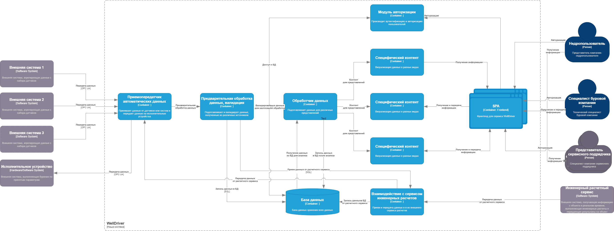

# ADR3 - Выбор подхода к созданию системы WellDriver

## Решение ПРИНЯТО

## Контекст

* Требования к системе WellDiver прописаны в документе [WellDriver](WellDriver.md)
* Компонентная схема системы была принята в [ADR2](ADR2.md)
* Необходимо выбрать подход к разработке системы WellDriver

# Компонентная схема из ADR3

## Варианты подходов

# 1. Использование NoCode платформы
Вариант использования NoCode платформы для программирования основного функционала сервиса с добавлением отдельного кода для реализации специфических функций

Оценка по критическим характеристикам:

* Доступность сервисов системы: # - нет информации, нет уверенности;
* Производительность: ## - нет достоверной информации, невозможно проверить без реализации;
* Надежность: ## - не очень высокая, нет уверенности в том, что NoCode платформа будет надежно работать, нет опыта;
* Информационная безопасность: ### - д.б. высокая, но надо проверять;
* Расширяемость: # - зависит от плагинов, нет уверенности в том , что удастся удовлетвоить все новые потребности;
* Масштабируемость: # - нет возможности проверить;
* Модифицируемость:### - довольно высокая, но зависит от реализации.
* Развертываемость: #  -нет информации.
* Время разработки (time to market): ### - небольшое, т.к. необходимо обучить разработчиков новому инструменту и есть вероятность необходимости реализации недостающего плагина
* Стоимость разработки: $ - небольшая, т.к. нет необходимости в программировании и оплаты за квалификацию разработчиков

# 2. Собственная разработка на базе монолитной архитектуры
Вариант использования команды квалифицированных программистов для программирования основного функционала сервиса

* Доступность сервисов системы: ### - высокая;
* Производительность: ### - высокая, нет межсервисных и сетевых взаимодействий;
* Надежность: ## - не очень высокая, зависит от квалификации разработчиков;
* Информационная безопасность: ### - д.б. высокая, если использовать проверенные сервисы;
* Расширяемость: # - невысокая, нужно изменять весь монолит, зависимость от frontend;
* Масштабируемость: ## - невысокая, только вертикальная, для горизонтальной нужно предусматривать дополнительные меры;
* Модифицируемость: ## - невысокая, Зависит от реализации и квалификации разработчиков.
* Развертываемость: ### - высокая, одним модулем.
* Время разработки (time to market): ## - довольно небольшое, т.к. нет необходимости заботитьсся о межсервисном взаимодействии
* Стоимость разработки: $$ - небольшая

# 3. Полнофункциональная разработка по микросервисной архитектуре
Вариант использования команды квалифицированных программистов для программирования основного функционала сервиса

* Доступность сервисов системы: ### - высокая;
* Производительность: ## - ниже, чем у монолита, есть межсервисные и сетевые взаимодействий;
* Надежность: ### - высокая, отказоустойчивость на высоте;
* Информационная безопасность: ### - д.б. высокая, если использовать проверенные сервисы;
* Расширяемость: ### - высокая, можно добавлять новые возможности на базе отдельных сервисов, процесс разработки и наличие функционала полностью в руках разработчиков;
* Масштабируемость: ### - высокая, возможна вертикальная и горизонтальная;
* Модифицируемость: ### - высокая, можно модифицировать посервисно.
* Развертываемость: ### - высокая, по отдельным модулям.
* Время разработки (time to market): # - довольно большое, т.к. есть необходимость заботитьсся об архитектуре, межсервисном взаимодействии и тестировании
* Стоимость разработки: $$$  - большая, нужны квалифицированные высокооплачиваемы разработчики и архитектор, также увеличены затраты на инфраструктуру

# Решение:
* Выбран вариант 3, учитывая специфику требований к системе WellDriver и компонентную схему.
 
# Последствия решения:

* мы полностью контролируем процесс разработки 
* легко расширять, модифицировать и масштабировать
* можем выбирать наиболее подходящий стек разработки и необходимые фреймворки

# Риски:
* недостаточная квалификация разработчиков и архитектора
* очень специфичные требования
* недостаток времени
* недостаток финансирования

