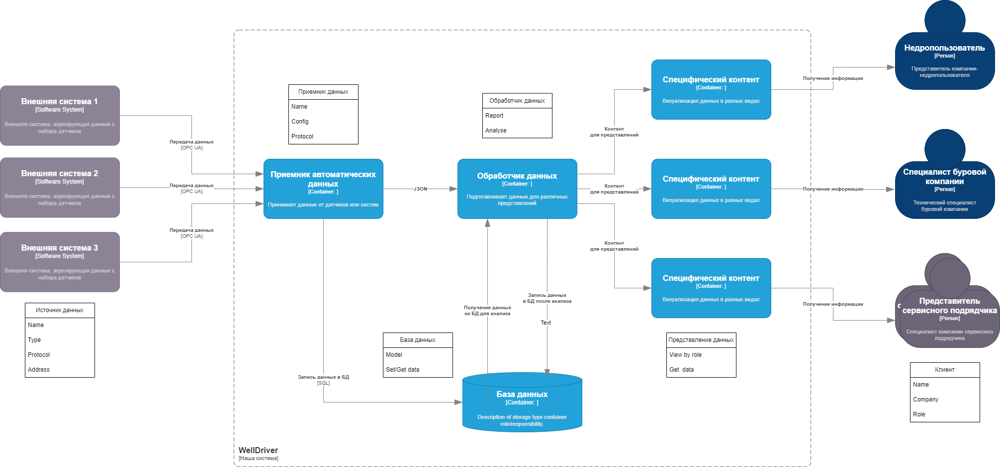
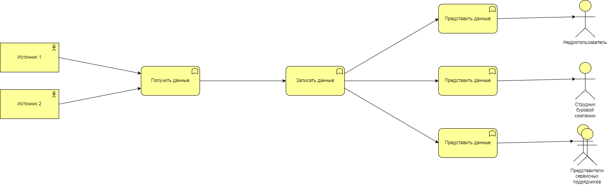
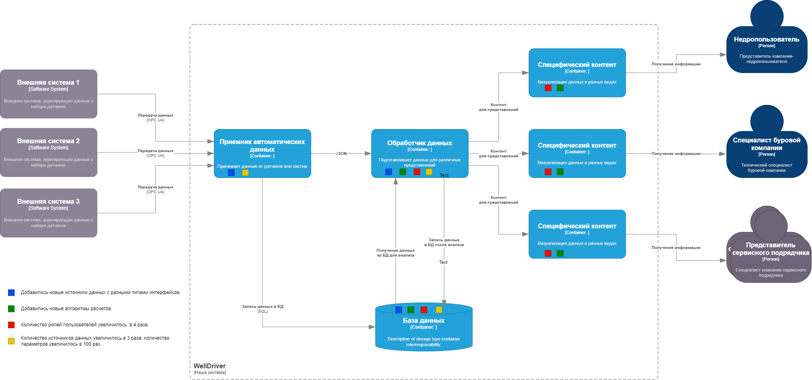
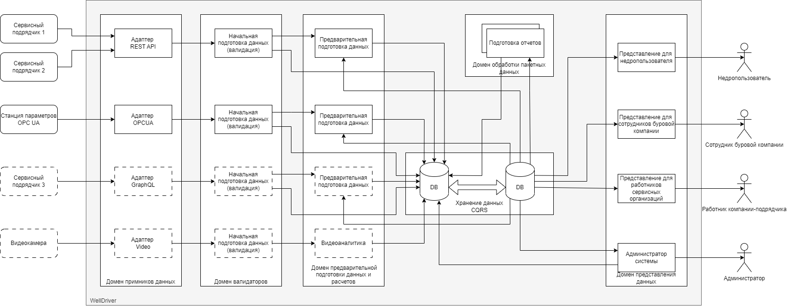

# WellDriver
В этот раз тема приближена к моей предметной области.

В последнее время в сфере нефтесервиса наметилась тенденция к цифровой трансформации процесса бурения нефтяных и газовых скважин. Такие понятия как "цифровой двойник буровой установки" или "интеллектуальное бурение" уже вошди в обиход как недропользователей, так и буровых компаний и сервисных подрядчиков. Основная цель - повысить эффективность строительства нефтегазовых скважин и обеспечить полную безопасность работ.  Надо сказать, что процесс строительства скважин имеет сложную структуру взаимодействия множества сервисных подрядчиков, каждый из которых преследует собственные бизнес-цели и имеет собственные средства и инструменты. Также процесс строительства скважин имеет собственную специфику, обусловленную удаленностью объектов, сложностью организации связи, постоянными перемещениями и непростыми природными условиями. 
В связи с этим была поставлена цель разработать инструмент, который бы собирал всю необходимую информацию с буровых установок, проводил комплексный анализ и обеспечивал автоматизированный процесс бурения. 

## Бизнес-цель

Разработать систему автоматизации и мониторинга процесса строительства нефтегазовых скважин для повышения эффективности бурения и обеспечения безопасности работ.

## Бизнес-драйверы

* Наша страна заинтересована в интенсификации нефтегазовой отрасли, как основного драйвера развития экономики. 
* Недропользователи заинтересованы в объективном контроле за работой буровых компаний и сервисных подрядчиков. 
* Буровые компании и сервисные подрядчики заинтеесованы в автоматизации процесса для снижения затрат и времени бурения, повышении качества и безопасности.
* Работники заинтересованы в атоматизации для улучшения условий труда, повышении зарплаты и безопасности.

## Требования

* Система WellDriver устанавливается на локальных объектах и имеет собственное хранилище. 
* Система собирает данные от всех источников.
* Необходимость сбора всех данных без потери.
* Система осуществляет предварительную обработку различных видов данных и анализ в интересах стейкхолдеров.
* Система производит визуализацию информации для мониторинга процесса бурения для заинтересованных лиц. 

## Дополнительный контекст

* Регистрация в программе только сотрудников компании по ролевой модели.
* Планируется расширение количества источников данных и сигналов.
* Планируется добавление аналитических задач.
* Планируется увеличение задач по мониторингу и алертингу при превышении заявленных параметров.

## Стайкхолдеры

* Стейкхолдеры по иерархии подряда в нефтесервисе - недропользователи (держатели месторождений) -> буровые компании (имеют буровые установки и могут бурить) -> сервисные подрядчики (нанимаются буровыми  компаниям по различным видам работ - буровые растворы, долота, наклонно-направленное бурение, автоматизация бурения и т.п.)
* Недропользователи в лице руководителей направлений заинтересованы в скорейшем освоении месторождений.
* Буровые компании и сервисные подрядчики в лице руководителей и специалистов заинтерeсованы в снижении затрат, качестве работ и безопасности.
* Работники и специалисты по своим направлениям заинтересованы в повышении качества работ, скорости проходки, безопасности и в конечном счете в увеличении зарплаты.  
* Команда разработки - заинтересована в разработке качественного конкурентоспособного продукта.

## Пользовательские истории

* Клиенты на локальном объекте регистрируются в системе и получают информацию по их направлению согласно ролевой модели.
* Руководители и специалисты-кураторы подключаются удаленно и получают соответствующую их роли информацию в реальном времени.
* Система автоматически получает данные с 2 источников информации на буровой площадке, у каждого источника 20 параметров.
* Система прводит в реальном времени предварительный анализ полученной информации для валидации данных.
* Система вычисляет значения параметров, которые должны быть выведены из анализа полученной в реальном времени информации. 
* Система получает информацию, вводимую вручную через формы ввода или оцифровкой файлов.
* Система проводит периодический анализ на исторических пакетных данных для составления отчетов.

## Атрибуты качества или свойства архитектурв

* Доступность - Сервис системы должен быть доступен с любое время (99,9 - исходя из специфики работы).
* Производительность - Время отклика < 1 секунды.
* Сохранность - Не должно быть потери информации.
* Безопасность - Полученная и обработанная информация должна храниться в безопасности.
* Расширяемость - Должна быть возможность подключения других алгоритмов расчета, любых новых источников данных и т.п.
* Масштабируемость - Должна быть предусмотрена возможность значительного увеличения источников данных и параметров (x100).
* Модифицируемость - возможность добавления новых функций и безшовного изменения старых.

## Критические сценарии и критические характеристики

* доступность сервисов системы , здесь подразумевается не только доступность через пользовательский интерфейс, но и доступность в смысле получения информации по всем данным;
* процент ошибочных ответов от сервиса - ориентироваться на 99.9%
* время ответа сервиса (95% квантиль времени ответа сервисов для клиента не должно превышать 1с);
* надежность: не должно быть потерянной информации;
* информационная безопасность – должны регистрироваться только сотрудники компаний, имеющих санкцонированный доступ к системе и информация не должна выходить за пределы контура безопасности;
* раширяемость – должна быть предусмотрена возможность подключения новых функций и возможностей;
* время разработки (time to market)
* стоимость разработки (budget/cost)

## Дополнительные требования

Необходимо сделать конфигурационный интерфейс для: 
* удаленного управления ролями пользователей;
* создания скважин;
* подключения новых источников данных и привязки параметров;
* изменения вариантов формирования отчетов;

## Разбиение на сущности:

* Сущность - клиенты: сотрудники и специалисты различных компаний (недропользователи, буровые компании, сервисные подрядчики)
* Сущность - специфический контент для пользователя
* Сущность - источники данных на буровой
* Сущность - универсальный приемник автоматических данных
* Сущность - хранилище данных
* Сущность - обработчик данных для подготовки специфического контента

## Функциональное разбиение:

 
* Функция - получить данные со всех источников.
* Функция - предварительно обработать данные.
* Функция - записать все данные в хранилище (БД).
* Функция - предоставить информацию пользователю в зависимости от запроса и роли.
* Функция - настроить конфигурацию (роли пользователей, новые источники данных). 

## Сравнение сущностного и функционального подходов:
На первый взгляд разбиение по блокам похоже, но "the devil in the details":
Функция Представление данных по ролям пользователей может выполняться в разных сущностях и это может повлиять на модифицируемость:
* в сущности Обработчик данных происходит предварительная обработка информации:
	* валидация полученных данных; 
	* рассчет допонительных параметров по сырым данным в реальном времени;
	* подготовка отчетов по результатам исторических данных;	
* в сущности Специфический контент производится подготовка информации "на лету" по запросам  пользователей согласно ролевой модели:
	* агрегация данных в зависимости от запроса; 
	* визуализация информации;	
	* предоставление доступа к специфическим ресурсам;
	
## Сценарии изменений

* Добавились новые источники данных с разными типами интерфейсов и обработки.
* Добавились новые алгоритмы расчетов.
* Количество ролей пользователей увеличилось  в 4 раза.
* Количество источников данных увеличилось в 3 раза, количество параметров увеличилось в 100 раз.

Понятно, что сценариев может быть значительно больше.

## Комментарий

Модель работы с данными пользователей системы WellDriver напоминает кейс по заказу товара на маркетплейсе.

| WellDriver                                 | Маркетплейс                                           |
|--------------------------------------------|-------------------------------------------------------|
| Получение данных на буровой установке      | Получение ходовых товаров по спискам маркетологов     |
| Сохранение данных в локальном хранилище    | Накопление товаров на складе маркетплейса             |
| Подготовка контента для представления      | Маркетинг, упаковка                                   |
| Предоставление данных сотрудникам компаний | Выбор и выдача товаров пользователям по их интересам  |

## Сравнительный анализ модифицируемости по сценариям

С оценкой стоимости реализации изменений:
* $$$ - потребуются очень большие изменения;
* $$ - потребуются значительные изменения;
* $ - потребуются незначительные изменения;

### Синий сценарий - Добавились новые источники данных с разными типами интерфейсов.
* Как видно из анализа, добавление новых источников данных с разными интерфейсами вляет на изменения в реализации 3 сервисов - Приемника, Обработчика и БД.
* Приемник надо модифицировать с точки зрения расширения возможности приема данных по другим протоколам и способам подключения - $$$.
* Обработчик надо модифицировать с точки зрения обработки новых типов данных - $$.
* БД надо модифицировать для хранения новых типов данных и атрибутов  - $. 

### Зеленый сценарий - Добавились новые алгоритмы расчетов.
* Этот сценарий влияет на сервисы Обработчика, БД и Представления специфического контента
* В Обработчик надо добавлять новый код, реализующий новые алгоритмы расчетов - $$$.
* В БД надо добавлять новые сущности по алгоритмам - $.
* Представления надо модифицировать с точки зрения визуализации новыйх результатов расчетов $$.

### Красный сценарий - Количество ролей пользователей увеличилось  в 4 раза. 
* Этот сценарий влияет на Обработчик, БД и Представления.
* Обработчик должен готовить данные для новых ролей - $$.
* БД должна сохранять информацию о ролях пользователей для разделения доступа - $$.
* Представления должны визуализировать контент для новых ролей - $$$.

### Желтый сценарий - Масштабирование - Количество источников данных увеличилось в 3 раза, количество параметров увеличилось в 100 раз..
* Реализация этого сценария влияет на Приемник, Обработчик и БД
* Примник должен выдерживать поступление большого количества информации из разных источников - $$$.
* БД должна уметь сохранить всю поступающую информацию и реализовывть backup данных - $$.
* Обработчик должен успевать обрабатывать все поступающие данные, в том числе в режиме реального времени - $$$.

## Анализ
* Видно, что вырисовывается 3 доменных области - Прием информации, Обработка и Представление.
* Основные изменения по сценариям пришлись на 2 сущности - Обработчик и БД, причем в БД нужно делать, в основном, незначительные изменения. 
* Видно два полюса притяжения - Получение данных и Представление, которые пытаются разорвать Обработчик и БД.
* Также возможна некоторая универсализация подходов:
    * Получение данных - использование стандартных интерфейсов и модульности.
	* Обработчик -  с точки зрения модульности (плагины) по алгоритмам.
	* Представление - нвстраиваемый фронтенд.
* Необходима доработка с точки зрения управления конфигурациями и новая роль - Алминистратор системы.	

### Вариант нового раделения:

Вырисовывается несколько доменов предметной области:
* Домен приемников данных - для каждого типа приемника свой адаптер.
* Домен начальной подготовки данных по правилам - валидация данных - для каждого типа приемника свое правило
* Домен предварительной обработки данных  - здесь производятся расчеты по данным реального времени, агрегация данных и т.п.
* Домен обработки пакетных данных - подготовка информации по историческим данным - отчеты и т.п.
* Домен хранения данных - хранилище данных, база данных, доступ к хранилищу организован по паттерну CQRS.
* Домен представления данных - каждому пользователю предоставляется свой контент в зависимости от роли.

Домены приемников и начальной подготовки данных можно объединить.
